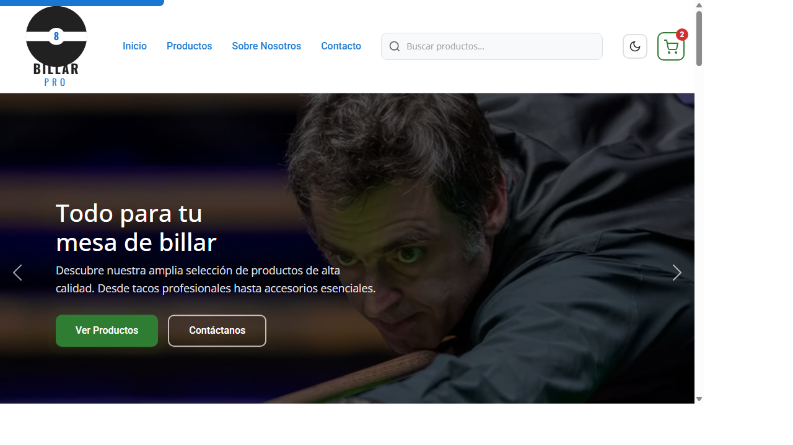
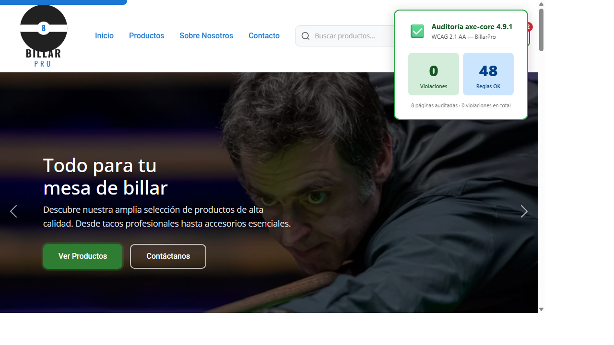
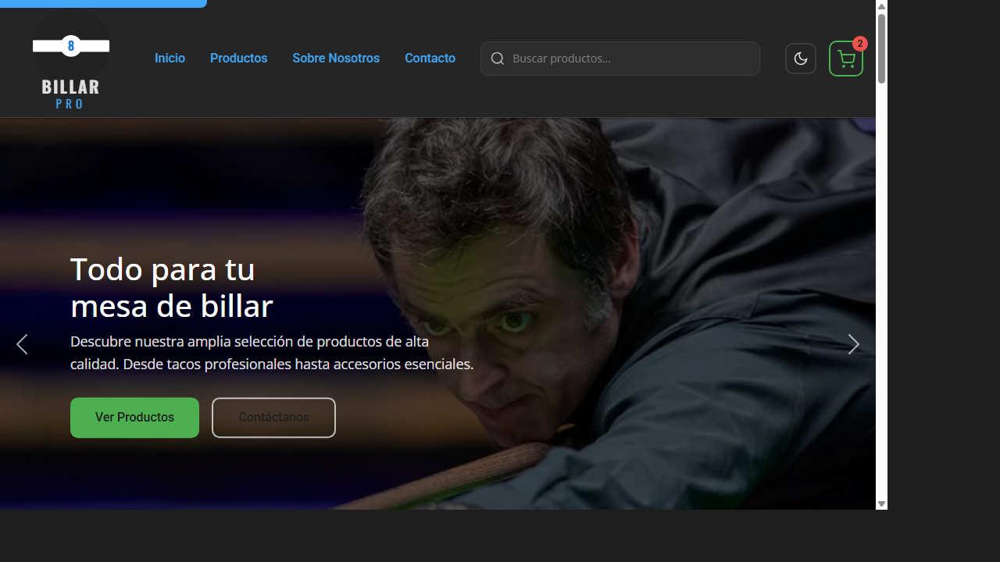
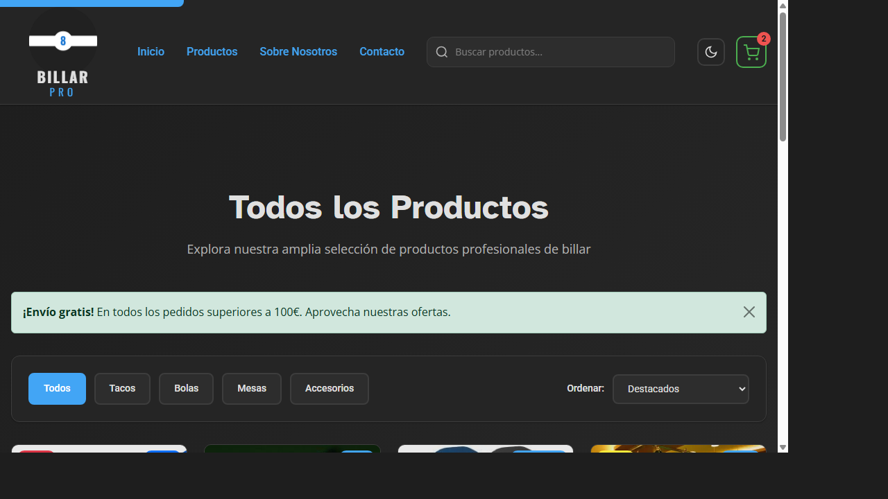

# BillarPro 🎱

**Tienda online de equipamiento profesional de billar**, desarrollada como proyecto de la asignatura **Diseño de Interfaces Web (DIW)** del ciclo formativo de **2.º DAW**.

BillarPro ofrece una experiencia de compra completa con catálogo de productos, carrito de la compra, página de contacto y búsqueda, respetando los estándares de accesibilidad WCAG 2.1 AA y las buenas prácticas de SEO.

---

## 👤 Autor

**fcasmen658** · [@fcasmen658](https://github.com/fcasmen658)
2.º DAW — Diseño de Interfaces Web · Tarea Online 06

---

## 🎥 Demostración en vídeo

> El siguiente vídeo muestra el funcionamiento de la web y sus contenidos interactivos en **dos navegadores diferentes** (Google Chrome y Mozilla Firefox).

[](https://youtu.be/ENLACE_AL_VIDEO)

> ⚠️ **Pendiente:** `ENLACE_AL_VIDEO`

---

## 🚀 Tecnologías utilizadas

| Tecnología | Versión | Uso |
|---|---|---|
| HTML5 semántico | — | Estructura, landmarks ARIA, accesibilidad |
| CSS3 (Custom Properties) | — | Estilos, animaciones, temas claro/oscuro |
| Bootstrap | 5.3.2 | Grid, componentes y layout responsive |
| JavaScript ES6+ (ES Modules) | — | Carrito, interactividad, localStorage |
| axe-core | 4.9.1 | Auditoría automática de accesibilidad WCAG |

---

## ✨ Funcionalidades implementadas

- **Carrusel héroe** con transiciones animadas (Bootstrap Carousel)
- **Pestañas interactivas** con contenido dinámico
- **Acordeón** de preguntas frecuentes (FAQ)
- **Carrito de la compra** con contador en tiempo real (ES Modules: `ShoppingCart.mjs`)
- **Valoración con estrellas** (★) persistente en `localStorage`
- **Leer más / Leer menos** con animación suave en extractos de producto
- **Especificaciones expandibles** con icono rotante en tarjetas de producto
- **Tema claro / oscuro** con transición CSS y persistencia en `localStorage`
- **Toast** de notificaciones al añadir al carrito
- **Botón Back-to-top** con scroll suave
- **Skip link** de accesibilidad en todas las páginas
- **Banner animado** (Google Web Designer)

---

## ♿ Accesibilidad

Auditoría realizada con **axe-core 4.9.1** (WCAG 2.1 AA) sobre las **8 páginas** del sitio.



| Resultado | Valor |
|---|---|
| ✅ Violaciones | **0** |
| ✅ Reglas superadas | **44–48 por página** |
| Estándar | WCAG 2.1 AA |
| Páginas auditadas | 8 |

### Aspectos revisados y verificados

- Contraste de color ≥ 4.5:1 (AA) en todos los elementos de texto
- Etiquetas semánticas: `<header>`, `<main>`, `<nav>`, `<footer>`, `<aside>`, `<section>`
- Skip link funcional (`<a href="#main-content">`) en todas las páginas
- Atributos ARIA: `aria-label`, `aria-expanded`, `aria-live`, `aria-controls`, `role`
- `lang="es"` declarado en todos los documentos
- Orden de encabezados correcto (h1 → h2 → h3) en todas las páginas
- Metadatos SEO: `description`, `keywords`, `author`, Open Graph (`og:title`, `og:description`, `og:type`)

---

## 📸 Capturas de pantalla

| Modo claro | Modo oscuro |
|:---:|:---:|
|  |  |



---

## 🌐 URLs del proyecto

- **Repositorio GitHub:** https://github.com/fcasmen658/fcasmen658.github.io
- **Página web (GitHub Pages):** https://github.com/fcasmen658/fcasmen658.github.io

---

## ⚙️ Ejecución en local

```bash
# Clonar el repositorio
git clone https://github.com/fcasmen658/fcasmen658.github.io
cd BillarPro

# Servir con npx (requiere Node.js)
npx serve . -l 3000

# Abrir en el navegador
# http://localhost:3000
```

---

## 📄 Estructura del proyecto

```
BillarPro/
├── index.html               # Página principal
├── productos.html           # Catálogo completo
├── producto_mesas.html      # Detalle: Mesas
├── producto_tacos.html      # Detalle: Tacos
├── producto_bolas.html      # Detalle: Bolas
├── producto_tizas.html      # Detalle: Tizas
├── busqueda.html            # Resultados de búsqueda
├── contacto.html            # Formulario de contacto
├── carrito.html             # Carrito de la compra
├── css/
│   ├── styles.css           # Estilos fuente
│   ├── styles.min.css       # Estilos minificados (cargados)
│   ├── animations.css       # Animaciones CSS
│   └── interactive.css      # Estilos de componentes interactivos
├── js/
│   ├── script.js            # Script principal
│   ├── ShoppingCart.mjs     # Módulo carrito (ES Module)
│   ├── cart-ui.js           # Interfaz carrito (ES Module)
│   └── interactive-features.js  # Estrellas, leer más, especificaciones
├── images/                  # Imágenes del sitio
├── assets/                  # Capturas de pantalla (README)
└── banner/                  # Banner animado (Google Web Designer)
```
